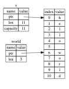

# rust playground

[러스트 공식문서](https://rinthel.github.io/rust-lang-book-ko/foreword.html)를 기반으로하는, 러스트 랭기지 학습 레포지토리 입니다.

* [How to install the rust ?](#how-to-install-the-rust-)
* [Hello world!](#hello-world)
* [Package manager](#package-manager)
* [IDE](#ide)
* [변수 구문 표현식](#변수-구문-표현식)
* [제어문](#제어문)
* [소유권](#소유권)
* [스택과 힙](#스택과-힙)
* [소유권 규칙](#소유권-규칙)
* [댕글링 포인터](#댕글링-포인터)
* [참조자 규칙](#참조자-규칙)
* [스트링 슬라이스](#스트링-슬라이스)
* [구조체](#구조체)
* [메소드](#메소드)
* [연관함수](#연관함수)


### How to install the rust ?

```
$ curl https://sh.rustup.rs -sSf | sh
```

### Hello world!

```shell
touch main.rs
```

```rust
fn main() {
    println!("Hello, world!");
}
```

```shell
$ rustc main.rs
$ ./main
Hello, world!
```

### Package manager
카고(Cargo)라는 툴을 사용한다. rustc 를 사용하는 것보다 카고로 패키지 매니징, 빌드, 등등 할 수 있나보다.
- cargo new xxx
- cargo build
- cargo build --release
- cargo run

### IDE
위에 저런거 하지말고.. IDE 쓰고 광명 찾자.젯 브레인의 노예인 나는 clion 이 제일 깔끔한 것 같다.

### 변수 구문 표현식
기본 문법들이 재밌다. 기본적으로 let 은 불변이고, 가변으로 쓰고싶으면 `let mut x = 10` 과 같이 써야한다.

그래서 가변을 방지하기 위해서 중복으로 선언(?)이 가능한데, 사실 중복 선언이라기보다 shadow 라는 개념을 도입해서 새로 선언할 때 기존 변수를 shadow 로 만들고, 메모리에서 지운다. 다음처럼 쓸 수 있다!

```rust
fn main() {
    // 이런 구문은 쓸 수 없다. (let 은 기본적으로 불변이기에)
    let x = 10;
    x = x * 100;

    // 이렇게 가변 처리를 한다. (mut : mutable)
    let mut x = 10;
    x = x * 100;

    // 위보다 조금 더 안전한 방법이 있다.
    let x = 10;
    let x = x * 10; // x 가 shadow
    
    println!("{}". x); // x : 100
    
    // {} 는 표현식을 의미한다.
    // 표현식은 마지막꺼가 반환 되는 듯!
    let y = {
        let x = 3;
        10
    };

}

// 표현식과 함수를 이용하면 이렇게도 쓸 수 있다.
// i32는 타입을 의미한다. (sigend integer)
// unsigned 는 u32 , u16 등등
fn five() -> i32 {
    5
}
```

### 제어문
엄청 특별한 건 없고..  
```rust
fn main() {
    if x == 1 {
        // println!('a');
    }
    else {
        println!("aa");
    }

    let c = if x == 1 {
        10
    }
    else {
        55
    };

    println!("{}", c);


    let a = [10, 20, 30, 40, 50];

    for element in a.iter() {
        println!("the value is: {}", element);
    }

    // 요건 무한루프에 빠진다.
    loop {
        println!("again!");
    }

    let mut number = 3;

    while number != 0 {
        println!("{}!", number);

        number = number - 1;
    }
}
```

### 소유권
러스트에만 있는 개념이란다. (확실하진 않음), GC 없이 메모리 안정성 보장을 해주는 개념

### 스택과 힙

많은 프로그래밍 언어들 안에서, 우리는 그렇게 자주 스택과 힙에 대한 생각을 할 필요가 없습니다. 그렇지만 러스트와 같은 시스템 프로그래밍 언어에서는, 값이 스택에 있는지 힙에 있는지의 여부가 언어의 동작 방식과 우리의 결단에 더 큰 영향을 줍니다. 우리는 이 장의 뒤쪽에서 스택과 힙에 관계된 소유권의 일부분을 기술할 것이기에, 여기서는 준비 삼아 간략한 설명만 하겠습니다.

스택과 힙 둘다 여러분의 코드상에서 런타임에 사용할 수 있는 메모리의 부분입니다만, 이들은 각기 다른 방식으로 구조화 되어 있습니다. 스택은 값을 받아들인 순서대로 값을 저장하고 반대 방향으로 값을 지웁니다. 이것을 last in, first out이라고 하죠. 쌓여있는 접시를 생각해보세요; 여러분이 접시를 더 추가하려면 접시더미의 꼭대기에 쌓아올리고, 여러분이 접시가 필요해지면 꼭대기에서부터 한장 꺼내게 됩니다. 중간이나 밑에서부터 접시를 추가하거나 제거하는 건 잘 안될겁니다! 데이터를 추가하는 것을 스택에 푸시하기 (pushing on the stack)라고 부르고, 데이터를 제거하는 것을 스택을 팝하기 (popping off the stack)라고 부릅니다.

스택은 데이터에 접근하는 방식 덕택에 빠릅니다: 이 방식은 새로운 데이터를 넣어두기 위한 공간 혹은 데이터를 가져올 공간을 검색할 필요가 전혀 없는데, 바로 그 공간이 항상 스택의 꼭대기(top)이기 때문입니다. 스택을 빠르게 해주는 또다른 특성은 스택에 담긴 모든 데이터가 결정되어 있는 고정된 크기를 갖고 있어야 한다는 점입니다.

컴파일 타임에 크기가 결정되어 있지 않거나 크기가 변경될 수 있는 데이터를 위해서는, 힙에 데이터를 저장할 수 있습니다. 힙은 조금 더 복잡합니다: 데이터를 힙에 넣을때, 먼저 저장할 공간이 있는지 물어봅니다. 그러면 운영체제가 충분히 커다란 힙 안의 빈 어떤 지점을 찾아서 이 곳을 사용중이라고 표시하고, 해당 지점의 포인터를 우리에게 돌려주죠. 이 절차를 힙 공간 할당하기(allocating on the heap)라고 부르고, 종종 그냥 "할당(allocating)"으로 줄여 부릅니다. 스택에 포인터를 푸싱하는 것은 할당에 해당되지 않습니다. 포인터는 결정되어 있는 고정된 크기의 값이므로, 우리는 스택에 포인터를 저장할 수 있지만, 실제 데이터를 사용하고자 할 때는 포인터를 따라가야 합니다.

힙에 저장된 데이터에 접근하는 것은 스택에 저장된 데이터에 접근하는 것보다 느린데, 그 이유는 포인터가 가리킨 곳을 따라가야 하기 때문입니다. 현대 프로세서들은 메모리 내부를 덜 뛰어다닐 때 더 빨라집니다. 유사한 예로, 여러 테이블로부터 주문을 받는 레스토랑의 웨이터를 생각해보세요. 다음 테이블로 움직이기 전에 지금 테이블에서 모든 주문을 다 받는 것이 가장 효율적이겠죠. A 테이블에서 하나 주문 받고, 다시 B 테이블로 가서 하나 주문 받고, 다시 A로, 다시 B로 가며 하나씩 주문을 받으면 훨씬 느려질 겁니다. 이와 마찬가지로, 프로세서는 (힙에 있는 데이터와 같이) 멀리 떨어져 있는 데이터들 보다는 (스택에 있는 것과 같이) 붙어있는 데이터들에 대한 작업을 하면 더 빨라집니다. 힙으로부터 큰 공간을 할당받는것 또한 시간이 걸릴 수 있습니다.

코드의 어느 부분이 힙의 어떤 데이터를 사용하는지 추적하는 것, 힙의 중복된 데이터의 양을 최소화하는 것, 그리고 힙 내에 사용하지 않는 데이터를 제거하여 공간이 모자라지 않게 하는 것은 모두 소유권과 관계된 문제들입니다. 여러분이 소유권을 이해하고 나면, 여러분은 더이상 스택과 힙에 대한 생각이 자주 필요치 않게 될겁니다만, 힙 데이터를 관리하는 것이 곧 소유권의 존재 이유임을 알게 되는 것은 이것이 어떤 방식으로 작동하는지 설명하는데 도움을 줄 수 있습니다.

### 소유권 규칙

1. 러스트의 각각의 값은 해당값의 오너(owner)라고 불리우는 변수를 갖고 있다.
1. 한번에 딱 하나의 오너만 존재할 수 있다.
1. 오너가 스코프 밖으로 벗어나는 때, 값은 버려진다(dropped).

일단 스택으로 관리되는 것은 다른 랭기지랑 크게 다를 바 없다. 다음 처럼 말이다.

```rust
{ // 뭔가 새로운 스콥 시작 -> 이것도 스택에 쌓이겠지? -> 아마도..
    let s = 10; // 스택에 쌓임

} // 스택 날라감
```

힙 관리는 어케 하는지 봐보자. 
```rust
// 힙으로부터 생성한다. (문자열 리터럴이랑 스트링은 다른 것!) 
let s = String::from("hello");

// 이상한 점: 이러면 빌드 실패 된다.
// 왜지?? push_str 하면 가변이 되기때문이라고 에러가 나옴
// 근데 어떻게 함수 에서 이게 가변인지 알아내는걸가?
let s = String::from("hello");
s.push_str("aa");
// 이건 되기때문에 이상함.
s.len();
println!("{}", s);
```
위에껄 쓰려면 이렇게 한다~ 
```rust
let mut s = String::from("hello");

s.push_str(", world!"); // push_str()은 해당 스트링 리터럴을 스트링에 붙여줍니다.

println!("{}", s); // 이 부분이 `hello, world!`를 출력할 겁니다.
```

자 근데, 위처럼 하면 힙으로부터 생성하는데, GC가 없는 러스틑 어떻게 힙 메모리에서 데이터를 지워줄까? 러스트는 아예 다른 방식으로 이 문제를 다룹니다: 메모리는 변수가 소속되어 있는 스코프 밖으로 벗어나는 순간 자동으로 반납됩니다. 
```rust
{
    let s = String::from("hello"); // s는 여기서부터 유효합니다

    // s를 가지고 뭔가 합니다
}                                  // 이 스코프는 끝났고, s는 더 이상 
                                   // 유효하지 않습니다
```

근데 이렇게 할당과 동시에 해제가되면 약간 복잡한 경우에는 문제가 될 수 있다. 그래서 변수 이동이라는 개념을 사용한다!
```rust
let s1 = String::from("hello");
let s2 = s1;
```


drop 만나면 요렇게 된다!


drop 의 기준은 스콥이 끝나는 것, 그래서 rust 에서는 GC 따로 없이 그냥 ptr로 이동하고 예전 것들 지우고 하나보다. `C++에 RAII` 생각해보면 쉽다.


좋은 예시가 있다. 1)

```rust
fn main() {
    let s = String::from("hello");  // s가 스코프 안으로 들어왔습니다.

    takes_ownership(s);             // s의 값이 함수 안으로 이동했습니다...
                                    // ... 그리고 이제 더이상 유효하지 않습니다.
    let x = 5;                      // x가 스코프 안으로 들어왔습니다.

    makes_copy(x);                  // x가 함수 안으로 이동했습니다만,
                                    // i32는 Copy가 되므로, x를 이후에 계속
                                    // 사용해도 됩니다.

} // 여기서 x는 스코프 밖으로 나가고, s도 그 후 나갑니다. 하지만 s는 이미 이동되었으므로,
  // 별다른 일이 발생하지 않습니다.

fn takes_ownership(some_string: String) { // some_string이 스코프 안으로 들어왔습니다.
    println!("{}", some_string);
} // 여기서 some_string이 스코프 밖으로 벗어났고 `drop`이 호출됩니다. 메모리는
  // 해제되었습니다.

fn makes_copy(some_integer: i32) { // some_integer이 스코프 안으로 들어왔습니다.
    println!("{}", some_integer);
} // 여기서 some_integer가 스코프 밖으로 벗어났습니다. 별다른 일은 발생하지 않습니다.
```

좋은 예시가 있다. 2)

```rust
fn main() {
    let s1 = gives_ownership();         // gives_ownership은 반환값을 s1에게
                                        // 이동시킵니다.

    let s2 = String::from("hello");     // s2가 스코프 안에 들어왔습니다.

    let s3 = takes_and_gives_back(s2);  // s2는 takes_and_gives_back 안으로
                                        // 이동되었고, 이 함수가 반환값을 s3으로도
                                        // 이동시켰습니다.

} // 여기서 s3는 스코프 밖으로 벗어났으며 drop이 호출됩니다. s2는 스코프 밖으로
  // 벗어났지만 이동되었으므로 아무 일도 일어나지 않습니다. s1은 스코프 밖으로
  // 벗어나서 drop이 호출됩니다.

fn gives_ownership() -> String {             // gives_ownership 함수가 반환 값을
                                             // 호출한 쪽으로 이동시킵니다.

    let some_string = String::from("hello"); // some_string이 스코프 안에 들어왔습니다.

    some_string                              // some_string이 반환되고, 호출한 쪽의
                                             // 함수로 이동됩니다.
}

// takes_and_gives_back 함수는 String을 하나 받아서 다른 하나를 반환합니다.
fn takes_and_gives_back(a_string: String) -> String { // a_string이 스코프
                                                      // 안으로 들어왔습니다.

    a_string  // a_string은 반환되고, 호출한 쪽의 함수로 이동됩니다.
}
```


근데 소유권을 넘겨버리면, 그 다음 스콥에서 이제 더 이상 해당 변수를 사용할 수 없게 된다. (생각해보면 너무 당연하다.) 그래서 러스트에서 참조자를 제공해준다. C랑 다르게 진짜 Call by references 인가보다.

```rust
fn main() {
    let s1 = String::from("hello");

    let len = calculate_length(&s1);

    println!("The length of '{}' is {}.", s1, len);
}

fn calculate_length(s: &String) -> usize {
    s.len()
}
```


참조자는 기본적으로 불변이며, 가변 시키고 싶으면 이렇게 쓴다. 근데 애초에 선언 자체가 mutable 하게 선언해야한다..! mut 와 imut 는 섞어 쓸 수 없다.

```rust
fn main() {
    let mut s = String::from("hello");

    change(&mut s);
}

fn change(some_string: &mut String) {
    some_string.push_str(", world");
}
```

### 댕글링 포인터

포인터가 있는 언어에서는 자칫 잘못하면 댕글링 포인터(dangling pointer) 를 만들기 쉬운데, 댕글링 포인터란 어떤 메모리를 가리키는 포인터를 보존하는 동안, 그 메모리를 해제함으로써 다른 개체에게 사용하도록 줘버렸을 지도 모를 메모리를 참조하고 있는 포인터를 말합니다. 이와는 반대로, 러스트에서는 컴파일러가 모든 참조자들이 댕글링 참조자가 되지 않도록 보장해 줍니다: 만일 우리가 어떤 데이터의 참조자를 만들었다면, 컴파일러는 그 참조자가 스코프 밖으로 벗어나기 전에는 데이터가 스코프 밖으로 벗어나지 않을 것임을 확인해 줄 것입니다.

### 참조자 규칙
1. 어떠한 경우이든 간에, 여러분은 아래 둘 다는 아니고 둘 중 하나만 가질 수 있습니다:
    1. 하나의 가변 참조자
    1. 임의 개수의 불변 참조자들
1. 참조자는 항상 유효해야만 한다.


### 스트링 슬라이스

스트링 슬라이스는 String의 일부분에 대한 참조자고, 아래와 같이 생겼습니다:

```rust
let s = String::from("hello world");

let hello = &s[0..5];
let world = &s[6..11];
```


스트링 리터럴은 슬라이스입니다
스트링 리터럴이 바이너리 안에 저장된다고 하는 얘기를 상기해봅시다. 이제 슬라이스에 대해 알았으니, 우리는 스트링 리터럴을 적합하게 이해할 수 있습니다:

### 구조체

```rust
struct User {
    username: String,
    email: String,
    sign_in_count: u64,
    active: bool,
}

let user1 = User {
   email: String::from("someone@example.com"),
   username: String::from("someusername123"),
   active: true,
   sign_in_count: 1,
};

let user2 = User {
   email: String::from("another@example.com"),
   username: String::from("anotherusername567"),
   ..user1
};

struct Color(i32, i32, i32);
struct Point(i32, i32, i32);

let black = Color(0, 0, 0);
let origin = Point(0, 0, 0);

```


### 메소드

```rust
#[derive(Debug)]
struct Rectangle {
    length: u32,
    width: u32,
}

impl Rectangle {
    // 자기것을 참조하기 위해서 self 를 참조자 형태로 넘긴다. 값으로 넘기면 사라지기 때문~
    fn area(&self) -> u32 {
        self.length * self.width
    }
}

fn main() {
    let rect1 = Rectangle { length: 50, width: 30 };

    println!(
        "The area of the rectangle is {} square pixels.",
        rect1.area()
    );
}
```

Rust 에서는 c 랑 다르게, 참조/역참조를 자동으로 해준다!! 그래서 그냥 . 으로 찍으면 다 됨 


### 연관함수

impl 에 self 키워드 빼고 만들 수 있다~ 이름이 함수인 이유는.. self 참조할 일이 없으니 당연히 메소드가 아니라 함수겠지? 주로 생성자등에 쓰인다고 한다. 

```rust
impl Rectangle {
    fn square(size: u32) -> Rectangle {
        Rectangle { length: size, width: size }
    }
}
```

### 열거형

언제 열거형이 구조체보다 유용할까? 일단 기본 문법들부터 보자. 다음과 같이 쓴다. 

```rust
enum IpAddrKind {
    V4,
    V6,
}
```

```rust
let four = IpAddrKind::V4;
let six = IpAddrKind::V6;
```

```rust
enum IpAddr {
    V4(u8, u8, u8, u8),
    V6(String),
}

let home = IpAddr::V4(127, 0, 0, 1);

let loopback = IpAddr::V6(String::from("::1"));
```

그럼 진짜 언제 열거형을 쓸까? 
1. 다양한 타입을 포함한 하나의 타입을 정의하고 싶을 때: Rust의 열거형은 각각의 variant가 다른 타입의 값을 가질 수 있다. 이는 여러 가지 상태나 타입을 한 타입으로 표현할 때 유용하다.

```rust
enum Option<T> {
    Some(T),
    None,
}
```

2. 패턴 매칭을 활용하고 싶을 때: 러스트 열거형이랑 패턴 매치가 좋다.

```rust
match some_option_value {
    Some(value) => println!("Got a value: {}", value),
    None => println!("Got no value"),
}
```

구조체는 진짜 말 그대로, 한 도메인의 속성들을 묶을 때 쓴다. ipV4 ipV6은 ip 의 속성이 아닌 것 처럼..

그리고 열거형으로 이런 재밌는 코드들도 할 수 있다. 이건 약간 swift 에 let 문법과 비슷?

```rust
let some_u8_value = Some(0u8);
match some_u8_value {
    Some(3) => println!("three"),
    _ => (),
}

if let Some(3) = some_u8_value {
    println!("three");
}
```

### 모듈

```shell
cargo new communicator --lib
```

이러면 요런 코드가짜란 하고 나온다.

```rust
pub fn add(left: usize, right: usize) -> usize {
    left + right
}

#[cfg(test)]
mod tests {
    use super::*;

    #[test]
    fn it_works() {
        let result = add(2, 2);
        assert_eq!(result, 4);
    }
}
```

러스트 내 모듈 정의는 모두 mod로 시작됩니다. 이 코드를 src/lib.rs의 시작 부분, 즉 테스트 코드의 윗 쪽에 추가해봅시다: